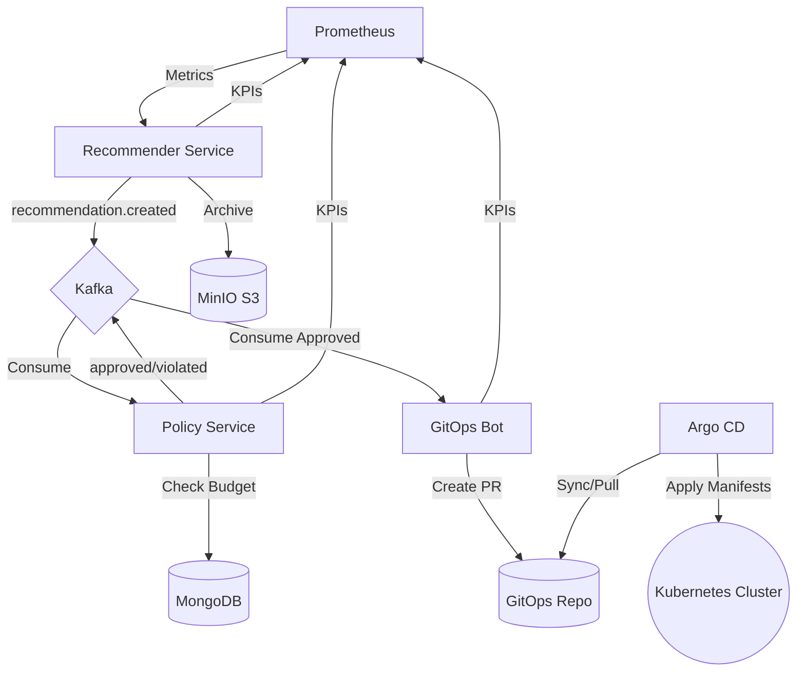

# 🚀 KubeFinOps Autopilot

**GitOps-driven FinOps Platform for Kubernetes Resource Optimization.**

KubeFinOps Autopilot is a professional platform engineering tool designed to automatically detect Kubernetes resource waste, validate changes against financial guardrails, and execute optimizations safely via Pull Requests and GitOps.

---

## 🎨 System Overview
The platform operates as a **closed-loop control system** (Analyze -> Govern -> Execute -> Measure):

1.  **Analyze**: `Recommender Service` monitors Prometheus metrics (CPU/RAM p95) and calculates optimal resource requests/limits.
2.  **Govern**: `Policy Service` validates proposals against namespace budgets (e.g., max $500/mo) and organizational guardrails.
3.  **Execute**: `GitOps Bot` intelligently edits YAML manifests in the configuration repository and opens Pull Requests.
4.  **Measure**: `Observability Stack` tracks KPIs like `waste_ratio` and `realized_savings` via Grafana.

---

## ✨ Key Features

-   **Automated Rightsizing**: Dynamic calculation of `requests` & `limits` based on historical usage to eliminate "cloud waste".
-   **Budget Guardrails**: Prevents expensive deployments by enforcing namespace-level dollar limits before changes are merged.
-   **Non-Prod Scheduler**: Automated "Sleep/Wake" cycles for development environments (scales replicas to 0 outside business hours).
-   **Intelligent GitOps**: Non-destructive YAML editing that preserves comments, labels, and sidecar configurations.
-   **Event-Driven Audit**: Every decision is traced via Kafka events and archived as JSON reports in **MinIO S3**.
-   **FinOps Dashboards**: Real-time visualization of potential vs. realized savings.

---

## 🏗️ Architecture



---

## 🛠️ Tech Stack

-   **Backend**: Java 21, Spring Boot 3.4, Project Reactor (WebFlux)
-   **Messaging**: Apache Kafka
-   **Databases**: MongoDB (Metadata), MinIO (Object Storage)
-   **Observability**: Prometheus, Grafana, Micrometer
-   **GitOps**: JGit (Git Automation), Jackson YAML (Intelligent Parsing)
-   **Infrastructure**: Docker Compose (Lite) / K3s (Production)

---

## 🚀 Getting Started (Local Dev)

### 1. Prerequisites
- Docker & Docker Compose
- Java 21 JDK
- Maven 3.9+

### 2. Launch the Platform
Run the automated bootstrap script to start infrastructure and microservices:
```bash
./kube-finops-autopilot/scripts/start-dev.sh
```

### 3. Access the Tools
- **Grafana Dashboards**: [http://localhost:3000](http://localhost:3000) (User: `admin` / `admin`)
- **MinIO Console**: [http://localhost:9001](http://localhost:9001) (User: `admin` / `password`)
- **Prometheus UI**: [http://localhost:9090](http://localhost:9090)

---

## 📈 Showing it to the World (Demo Scenario)

To demonstrate the **Budget Guardrail** feature:

1.  **Observe normal flow**: Recommender generates a change -> Policy approves -> PR is created.
2.  **Tighten the budget**:
    ```bash
    docker exec infra-mongodb-1 mongosh kubefinops --eval 'db.policies.updateOne({name: "Global Budget Limit"}, {$set: {maxMonthlyCost: 5.0}})'
    ```
3.  **Watch the rejection**: Check `policy.log`. The system will now block recommendations that exceed the $5 limit, sending a `policy.violated` event instead of approving the PR.
4.  **Verify Audit**: Log in to MinIO to see the technical JSON reports generated for every recommendation.

---

## 🗺️ Roadmap
- [x] Event-Driven Backbone (Kafka)
- [x] Intelligent YAML Editing
- [x] S3 Report Archiving
- [x] Namespace-level Budgeting
- [ ] Full K3s + Argo CD Integration
- [ ] Machine Learning for better p99 predictions

---
*Developed as a Portfolio Showcase for Cloud Native Platform Engineering.*