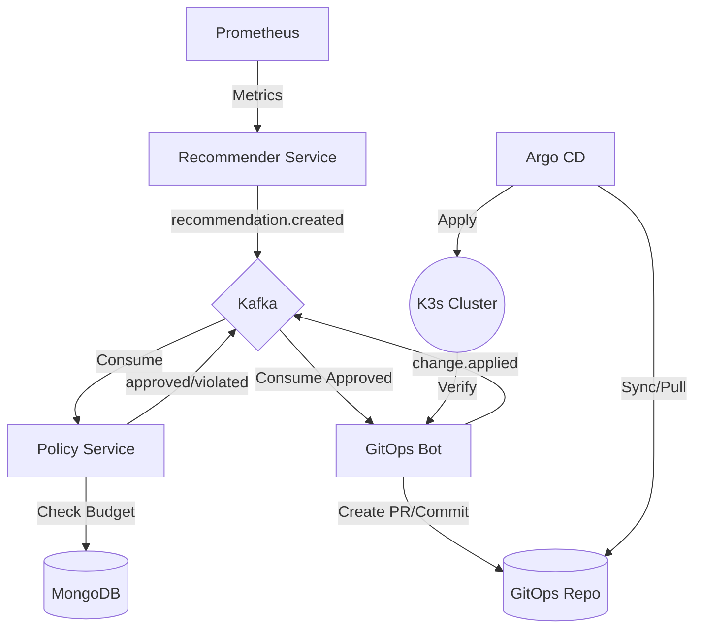

# KubeFinOps Autopilot

[](https://github.com/dawidbera/kube-finops-autopilot) 
[](https://github.com/dawidbera/kube-finops-autopilot) 
[](https://github.com/dawidbera/kube-finops-autopilot)

**KubeFinOps Autopilot** is a GitOps-driven platform engineering tool designed to autonomously detect Kubernetes resource waste, calculate optimal rightsizing recommendations, and execute changes safely via Pull Requests and Argo CD.

The project implements a full **closed-loop control system**: Analyze -> Plan -> Verify -> Execute -> Measure.

---

## 🚀 Key Features

- **Automated Rightsizing**: Dynamic calculation of `requests` and `limits` based on P95/P99 historical usage from Prometheus.
- **Budget Guardrails**: `Policy Service` validates all changes against namespace budgets and resource quotas before allowing execution.
- **Non-Prod Scheduler**: Automated "Sleep/Wake" cycles for development environments to eliminate idle costs.
- **GitOps-First Execution**: No direct cluster patches. Changes are committed to Git by the bot, ensuring a full audit trail.
- **Feedback Loop**: `SyncMonitor` verifies that Argo CD successfully applied changes to the cluster and emits confirmation events.
- **FinOps Observability**: Out-of-the-box Grafana dashboards for monitoring savings, waste ratio, and apply success rates.

---

## 🏗 Architecture

The platform follows an event-driven microservices architecture using **Apache Kafka** as the backbone.



### Microservices:
1.  **Recommender Service**: Analyzing usage patterns and generating rightsizing proposals.
2.  **Policy Service**: Validating recommendations against governance rules (Budgets, Max Limits).
3.  **GitOps Bot**: Handling Git operations (JGit) and monitoring cluster synchronization (Fabric8).

---

## 🛠 Tech Stack

- **Core**: Java 21, Spring Boot 3.4, Spring Cloud Stream.
- **Messaging**: Apache Kafka (SASL/SCRAM authentication).
- **Storage**: MongoDB (Policy/Recommendation metadata), MinIO (Reports).
- **Orchestration**: K3s (Kubernetes), Helm.
- **GitOps**: Argo CD.
- **Observability**: Prometheus, Grafana.

---

## 📂 Repositories

This project follows the **3-Repo Pattern**:

1.  **[kube-finops-autopilot](https://github.com/dawidbera/kube-finops-autopilot)** (This Repo): Platform source code, Helm charts, and core infrastructure.
2.  **[smarthealth-gitops](https://github.com/dawidbera/smarthealth-gitops)**: **Source of Truth** for the cluster state. Contains Kubernetes manifests managed by Argo CD.
3.  **Application Repo**: (Mocked) Source code of the target applications.

---

## 📦 Quick Start (Local Setup on K3s)

### 1. Prerequisities
- Linux OS with `k3s` installed.
- `helm` and `docker` installed.
- GitHub Personal Access Token (PAT) with `contents:write` permission.

### 2. Install Infrastructure
```bash
./scripts/install-infra-k3s.sh
```

### 3. Deploy Platform
```bash
helm upgrade --install kubefinops-platform ./deploy/helm/kubefinops-platform \
  -n kubefinops \
  --set bot.gitToken="YOUR_GITHUB_TOKEN"
```

### 4. Observe the Loop
Monitor the `dev` namespace to see the load generator and the rightsizing in action:
```bash
kubectl get pods -n dev -w
```

---

## 📊 Monitoring & Audit

- **Grafana Dashboard**: Access `http://localhost:3000` (User: `admin`). Find the "FinOps Overview" dashboard.
- **Kafka Events**: Use `kafka-console-consumer` to observe the `recommendation.*` and `change.applied` topics.
- **Audit Logs**: Every decision is stored in MongoDB and reflected in the Git history of the targeted repository.

---

## 📜 Maintenance
- **Documentation**: Managed via `GEMINI.md` and standard project docs.
- **Control Loop**: Verification is performed by the `SyncMonitor` component within the GitOps Bot.
